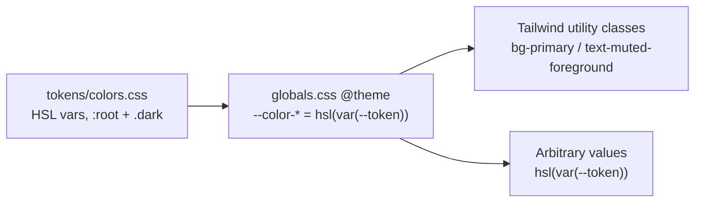

# Framevis Design System

Updated: 2026-08-27

Canonical reference for colors, type, radius, shadow, spacing, and **how to compose the base
components** in framevis-erp. Read this before styling anything — humans and AI code agents alike.
Source design file: Claude Design **"Framevis - Bộ Token (Light + Dark)"**. Refactor plan:
[`docs/plans/2026-07-02-framevis-token-ds-refactor.md`](./plans/2026-07-02-framevis-token-ds-refactor.md).

Theme: warm cream + magenta (primary = the magenta/violet ramp, 50–950). Light = `:root`, dark = `.dark` (toggled by `next-themes`).

---

## 1. Overview + the golden rules

> **1. Never hardcode hex/rgb/hsl in `className` or `style`, and never use raw Tailwind palette
> classes (`bg-blue-500`, `text-red-600`). Always go through a token.**
>
> **2. Compose base components from `src/components/ui/`; drive their appearance with `variant` /
> `size` props, never by re-styling them in `className`.** A feature component composes — it
> doesn't style. See [§5b](#5b-component-first-props-over-classname).

Pipeline:



- Colors are defined **once**, as HSL CSS custom properties, in `src/styles/tokens/colors.css`
  (`:root` = light, `.dark` = dark).
- `src/styles/globals.css` maps each `--token` to a Tailwind v4 `--color-*` theme key inside
  `@theme`, which is what makes `bg-primary`, `text-foreground`, `border-border`, etc. exist as
  utility classes.
- Anywhere Tailwind utilities don't reach (SVG `stroke`/`fill`, inline `style`, recharts props,
  arbitrary-value brackets), compose the color with `hsl(var(--token))`.
- **See it live**: the `/dev/ui` route (dev-only gallery, `src/app/dev/ui/page.tsx`) renders every
  token group and component in both light and dark — toggle the sun/moon button top-right.

---

## 2. Fonts

Loaded once in `src/app/layout.tsx` via `next/font/google`, exposed as CSS variables on `<body>`,
and aliased in `src/styles/tokens/typography.css`.

| Font | CSS var | Utility | Use |
|---|---|---|---|
| **Be Vietnam Pro** | `--font-be-vietnam-pro` → `--font-sans` | default (body) | UI + body text. The default font for everything unless overridden. Weights 400–900. |
| **IBM Plex Mono** | `--font-ibm-plex-mono` → `--font-mono` | `font-mono` | Numbers, codes, labels — prices, IDs, uppercase tracked labels (e.g. `4.000.000 ₫`, `Label · IBM Plex Mono 11 / uppercase`). Weights 400–600. |
| **Newsreader** | `--font-newsreader` → `--font-serif` / `--font-display` | `font-display` | Italic editorial accent inside headings, and the **"Framevis"** wordmark in `AuthBrand`. Loaded `normal` + `italic`. |
| **Playfair Display** | `--font-playfair` → `--font-logo` | `font-family-logo` | The **"Framevis Studio"** wordmark in `BrandLogo` (landing header/footer) only. Variable weight, `latin` + `vietnamese` subsets. |

### Type scale (`src/styles/tokens/typography.css`)

| Token | Size | Notes |
|---|---|---|
| `--text-display-2xl` | `clamp(2.25rem, 6vw + 1rem, 3.75rem)` | 36px → 60px, fluid |
| `--text-display-xl` | `clamp(2rem, 5vw + 0.5rem, 3rem)` | 32px → 48px, fluid |
| `--text-display-lg` | `clamp(1.75rem, 4vw + 0.5rem, 2.25rem)` | 28px → 36px, fluid |
| `--text-h1` | 1.875rem (30px) | weight 700 |
| `--text-h2` | 1.5rem (24px) | weight 700 |
| `--text-h3` | 1.25rem (20px) | weight 700 |
| `--text-h4` | 1.125rem (18px) | |
| `--text-body-lg` | 1.125rem (18px) | |
| `--text-body` | 1rem (16px) | default body |
| `--text-body-sm` | 0.875rem (14px) | |
| `--text-caption` | 0.75rem (12px) | |

Line-height tokens: `--leading-tight` 1.25 · `--leading-snug` 1.375 · `--leading-normal` 1.5 ·
`--leading-relaxed` 1.625.

Weight tokens: `--font-weight-regular` 400 · `-medium` 500 · `-semibold` 600 · `-bold` 700.

Display sizes are **fluid** (`clamp()`) — they scale down automatically on phones and cap at the
desktop value; no manual `sm:`/`lg:` breakpoints needed for display text.

---

## 3. Color token catalog

Exact per-mode HSL values live in `src/styles/tokens/colors.css` with the source hex as a trailing
comment on every line — treat that file as ground truth; the hex below is for quick visual
reference only.

### Brand

Primary is the magenta/violet ramp (`--primary-50` … `--primary-950`, all 11 steps mapped in
`@theme` → `bg-primary-400`, `text-primary-700`, …). Light = standard ramp (50 lightest → 950 darkest);
**dark is inverted by lightness**, so `bg-primary-50` stays a subtle tint and `text-primary-600` stays
bright emphasis in both modes. `--primary` === `--primary-500`.

| Token | Light | Dark | Use |
|---|---|---|---|
| `--primary` / `bg-primary` | `#B026C6` | `#B83FCE` | Nút chính, link, active, ring |
| `--primary-foreground` | `#FFFFFF` | `#FFFFFF` | Text on solid primary |
| `--primary-50` | `#FBEAFB` | `#2A1430` (subtle bg) | Nền chip/nav active, icon tile |
| `--primary-100` | `#F3D4F5` | `#3E1C47` (border) | Viền nhấn nhạt |
| `--primary-200…400` | `#E8B4EE…#C556D2` | inverted steps | Ramp steps for gradients, hover, fills |
| `--primary-600` | `#921FA6` | `#E79BF2` (emphasis text) | Hover đậm / chữ trên nền tint |
| `--primary-700…950` | `#7A1A8A…#350A3D` | inverted steps | Deeper tints / on-dark emphasis |
| `--brand-violet` / `--brand-magenta` / `--brand-pink` | `#A24BFF` / `#E144E9` / `#F5539A` | same | Gradient stops (logo, CTA) |
| `--gradient-primary` | `linear-gradient(135deg, #A24BFF, #E144E9, #F5539A)` | same | Brand gradient — `bg-gradient-primary` utility |

### Neutral (warm ecru)

| Token | Light | Dark | Use |
|---|---|---|---|
| `--background` | `#F6F5F3` | `#131416` | Page background |
| `--foreground` | `#1B1A17` | `#E7E9EE` | Default text |
| `--card` | `#FFFFFF` | `#1B1D20` | Card surface |
| `--card-foreground` | `#1B1A17` | `#E7E9EE` | Text on card |
| `--popover` | `#FFFFFF` | `#202327` | Popover/dropdown surface |
| `--popover-foreground` | `#1B1A17` | `#E7E9EE` | Text on popover |
| `--secondary` | `#F0EEE9` | `#24272B` | Nút phụ, nền khối |
| `--secondary-foreground` | `#3A362F` | `#E7E9EE` | Text on secondary |
| `--muted` | `#F2F1ED` | `#25282C` | Nền mờ, hover hàng |
| `--muted-foreground` | `#6E6A62` | `#9AA1AC` | Chữ phụ, caption |
| `--accent` | `#F1EFEA` | `#2A2E33` | Nền hover item |
| `--accent-foreground` | `#1B1A17` | `#E7E9EE` | Text on accent |
| `--border` | `#E9E7E2` | `#2E3238` | Default border |
| `--input` | `#E9E7E2` | `#383D44` | Input border |
| `--divider` | `#F0EEE9` | `#24282D` | Divider lines |
| `--ring` | = `--primary` | = `--primary` | Focus ring |

### Semantic (status)

Status maps to booking lifecycle: **pending → warning · confirmed → info · done → success ·
cancelled → destructive**. Each has a base (dot/solid), `-foreground` (text on the solid fill),
`-soft` (pill background), and `-deep` (pill text) — see `colors.css` for the exact `-soft`/`-deep`
HSL per mode.

| Token | Light | Dark | Use |
|---|---|---|---|
| `--warning` | `#E0962E` | `#E0A24A` | pending — dot/border |
| `--info` | `#2B8FD0` | `#4BA3DD` | confirmed |
| `--success` | `#1F9D52` | `#35B36A` | done |
| `--destructive` | `#C92E37` | `#ED6870` | cancelled, danger actions |

Each also has `-foreground`, `-soft`, `-deep` variants (e.g. `--warning-soft`, `--warning-deep`) —
consume via `bg-warning-soft text-warning-deep` for pills, `bg-warning text-warning-foreground` for
solid chips. Full values in `colors.css`.

### Position chips (`src/lib/positions.ts`)

Fixed per-position color pairs, consumed via `<PositionChip />` / `positionConfig`:

| Position | Label (vi) | Soft | Deep |
|---|---|---|---|
| `main` | Thợ chính | `--chip-main-soft` `#F7E6FA` | `--chip-main-deep` `#921FA6` |
| `assistant` | Thợ phụ | `--chip-blue-soft` `#E8EEF9` | `--chip-blue-deep` `#33529E` |
| `makeup` | Makeup | `--chip-pink-soft` `#FCE7F3` | `--chip-pink-deep` `#A82D74` |
| `owner` | Owner | `--chip-owner-soft` `#F0EEE9` | `--chip-owner-deep` `#57534C` |
| `freelance` | Freelance | `--chip-amber-soft` `#FBF1DE` | `--chip-amber-deep` `#8A5A12` |

`-soft` = background, `-deep` = text. Dark-mode values are in `colors.css`.

### Avatar palette (`src/lib/avatar.ts`)

Hash-of-name → stable color per person; text is always white.

| Token | Light hex |
|---|---|
| `--avatar-1` | `#B026C6` |
| `--avatar-2` | `#D9489A` |
| `--avatar-3` | `#3A5BBF` |
| `--avatar-4` | `#C2557A` |
| `--avatar-5` | `#BE7A1C` |
| `--avatar-6` | `#1F9D72` |

`getAvatarColor(name)` → solid `bg-avatar-N` (round avatar, white text). `getAvatarTile(name)` →
soft tinted tile `bg-avatar-N/12 text-avatar-N` (same hash, so a person's tile and avatar match).
Dark-mode values are in `colors.css`.

### Chart / data-viz (recharts)

Use `fill="hsl(var(--chart-1))"` etc. — Recharts needs a resolved color string, not a Tailwind
class.

| Token | Light hex |
|---|---|
| `--chart-1` | `#B026C6` |
| `--chart-2` | `#7C4DEC` |
| `--chart-3` | `#3B72E0` |
| `--chart-4` | `#1F9D72` |
| `--chart-5` | `#E0962E` |
| `--chart-6` | `#E0679F` |

---

## 4. Radius, shadow, spacing

### Radius (`src/styles/tokens/radius.css`)

| Token | Class | Value |
|---|---|---|
| `--radius-sm` | `rounded-sm` | 7px |
| `--radius` (DEFAULT) | `rounded-md` | 9px |
| `--radius-md` | `rounded-md` | 9px |
| `--radius-lg` | `rounded-lg` | 11px |
| `--radius-xl` | `rounded-xl` | 14px |
| `--radius-2xl` | `rounded-2xl` | 16px |
| `--radius-full` | `rounded-full` | 9999px |

### Shadow (`src/styles/tokens/shadows.css`)

Neutral shadows use warm ink `rgb(20 19 16 / α)`; the two "lifted" elevations (`pop`, `primary`)
use **magenta** `rgb(176 38 198 / α)` to tie elevation to the brand color.

| Token | Class | Value | Use |
|---|---|---|---|
| `--shadow-card` | `shadow-card` | `0 1px 3px 0 rgb(20 19 16 / 0.06)` | Card at rest |
| `--shadow-pop` | `shadow-pop` | `0 4px 14px 0 rgb(176 38 198 / 0.14)` (magenta) | Card hover |
| `--shadow-primary` | `shadow-primary` | `0 2px 10px 0 rgb(176 38 198 / 0.30)` (magenta) | Primary button |
| `--shadow-modal` | `shadow-modal` | `0 20px 60px 0 rgb(20 19 16 / 0.20)` | Dialog/modal |

(Generic `--shadow-xs/sm/DEFAULT/md` also exist for lower-level composition — prefer the four
named DS shadows above for product UI.)

### Spacing (`src/styles/tokens/spacing.css`)

4px scale, `--space-0` through `--space-32` (0, 1px, 0.125rem, then every 0.125–0.25rem step up to
8rem) — mirrors Tailwind's default spacing scale, so plain Tailwind spacing utilities (`p-4`,
`gap-2`, `mt-6`) already resolve correctly; the `--space-*` vars exist for non-Tailwind contexts
(inline styles, canvas layout math).

---

## 4b. Motion (overlay animations)

Overlay enter/exit motion (`SlideOver` panel + its scrim, so far — see "Known gap" below) does
**not** use `tailwindcss-animate`'s `animate-in`/`animate-out`/`slide-in-from-right`/`fade-in-0`
classes. **That plugin isn't installed in this project** (Tailwind v4, `src/styles/globals.css` is a
bare `@import 'tailwindcss'`; `package.json` has neither `tailwindcss-animate` nor
`tw-animate-css`). Those classes compile to nothing, so any component still wearing them mounts and
unmounts instantly instead of animating, which reads as a "giật" jump, not a slow animation.

The project's own overlay-motion utilities live in `src/styles/globals.css`, right after
`animate-content-in`:

| Utility | Applies to | Duration · easing | Fill mode |
|---|---|---|---|
| `animate-slideover-in` | `SlideOver` panel, `data-[state=open]:` | 0.32s `cubic-bezier(0.32, 0.72, 0, 1)` | `backwards` |
| `animate-slideover-out` | `SlideOver` panel, `data-[state=closed]:` | 0.22s `cubic-bezier(0.4, 0, 1, 1)` | `forwards` |
| `animate-scrim-in` | `SlideOver` overlay (backdrop), `data-[state=open]:` | 0.32s `ease-out` | `backwards` |
| `animate-scrim-out` | `SlideOver` overlay (backdrop), `data-[state=closed]:` | 0.2s `ease-in` | `forwards` |

Rules baked into that block:

- **Only animate `transform` + `opacity`** (never `left`/`width`) so the browser runs it on the
  compositor instead of reflowing every frame.
- **In is slower than out**: 0.32s deceleration entering gives the panel some weight; 0.22s
  acceleration leaving means closing doesn't feel like it's waiting on the animation.
- **`backwards` on the way in, `forwards` on the way out. Never `both`, and never
  `will-change: transform`.** Both leave a transform (or a standing promise of one) on the panel
  after the animation finishes, and an element with a transform becomes the containing block for
  every descendant `position: fixed`. `SlideOver` has exactly this kind of child: the
  click-outside layer (`fixed inset-0`) of the album search dropdown in
  `BookingClientAlbumsSection.tsx` would shrink to the panel's own bounds, and clicking outside the
  panel would stop closing the dropdown. The browser still promotes the element to its own
  compositor layer while `transform` is actively animating, so dropping `will-change` doesn't cost
  smoothness.
- **`prefers-reduced-motion: reduce` is nested inside each `@utility`, not written as one `@media`
  block at the end of the file.** These utilities are always paired with a Tailwind state variant
  (`data-[state=open]:animate-slideover-in`), so Tailwind only ever emits the compound selector
  `.data-\[state\=open\]\:animate-slideover-in[data-state=open]` — a bare `.animate-slideover-in`
  rule would never match anything on its own, so the reduced-motion override has to live inside the
  utility that generates that compound selector. Reduced motion drops the slide but keeps a short
  0.14s fade, **not** `animation: none` — Radix `Presence` waits for `animationend` before
  unmounting, so killing the animation entirely leaves the closed panel stuck in the DOM.
- **`animate-in` / `animate-out` / `slide-in-from-right` / `slide-out-to-right` / `fade-in-0` /
  `fade-out-0` do not exist in this project.** Don't reintroduce them on any overlay; without
  `tailwindcss-animate` they compile to nothing.
- `animate-content-in` (pre-existing, right above this block) is for a skeleton→data swap
  **inside** an already-open surface (e.g. `DataTable` rows replacing their skeleton, or
  `BookingDetailPanel`'s body once `useBooking` resolves mid-slide) — not an overlay's own
  enter/exit. Pair it with `motion-reduce:animate-none`.

**Known gap:** `Dialog.tsx`, `BottomSheet.tsx`, `DropdownMenu.tsx`, `Popover.tsx`, `Select.tsx`,
`Tooltip.tsx`, plus `TestimonialNudgeCard.tsx` and `CoverPhotoEditor.tsx` still carry the dead
`tailwindcss-animate` classes and still mount/unmount instantly. `SlideOver` is the only overlay
primitive fixed so far.

---

## 5. How to use tokens (recipes)

**Solid surfaces / text:**

```tsx
<div className="bg-card text-card-foreground border border-border rounded-lg shadow-card">
<Button className="bg-primary text-primary-foreground shadow-primary">
<p className="text-muted-foreground">Ghi chú buổi chụp khách hàng.</p>
```

**Opacity modifiers** — tokens compose with Tailwind's `/N` opacity syntax:

```tsx
<div className="bg-primary/10">
<div className="border-success/40">
<input className="ring-primary/50">
```

**Arbitrary values that need a token color** — wrap the var in `hsl()`:

```tsx
<div className="shadow-[0_0_18px_-12px_hsl(var(--warning)/0.4)]">
<svg><rect stroke="hsl(var(--border))" /></svg>
<Line stroke="hsl(var(--chart-2))" />  {/* recharts */}
```

**Brand gradient CTA:**

```tsx
<Button className="bg-gradient-primary text-primary-foreground shadow-primary">
  Tạo lịch hẹn
</Button>
```

**Status pill / badge / position chip** — don't hand-roll status colors; use the canonical
components, which already encode the pending/confirmed/done/cancelled → warning/info/success/destructive
mapping and the position → chip-color mapping:

- `<StatusPill status="pending|confirmed|done|cancelled" />` — `src/components/ui/StatusPill.tsx`
- `<Badge variant="muted|warning|success|info|outline">` — `src/components/ui/Badge.tsx`
- `<PositionChip position="main|assistant|makeup|owner|freelance" />` — `src/components/ui/PositionChip.tsx`, backed by `src/lib/positions.ts`

**Dark mode** — do **not** add `dark:bg-*`/`dark:text-*` overrides for token colors; the token
itself flips value inside `.dark` in `colors.css`, so `bg-card` is already correct in both modes.
Only reach for `dark:` when tweaking something that isn't a color token (e.g. an opacity or a
non-token decorative value).

---

## 5b. Component-first: props over `className`

Tokens keep the *colors* consistent; base components keep the *shapes* consistent. Both are needed —
a screen built from tokenised but hand-rolled markup still drifts, because nothing propagates when
the design system changes. So: **find the primitive in `src/components/ui/` first**, and configure
it through props.

**What goes where**

| Concern | Where it lives |
|---|---|
| Height, padding, radius, type scale | the primitive's `size` prop (`sm` / `md` / `lg`) |
| Color / emphasis / intent | the primitive's `variant` prop |
| Where it sits in the layout | `className` — `w-full`, `flex-1`, `mt-4`, `gap-2`, `shrink-0`, `truncate`, `col-span-2` |
| A look no primitive has yet | a **new `variant`/`size` in that primitive**, or a **new primitive** — not a className in a feature file |

**One height scale, every width**

`src/components/ui/field-size.ts` and `Button`'s `size` are flat — no `sm:` step:

| `size` | Height | Use for |
|---|---|---|
| `sm` · `icon-sm` | 32px | dense rows, filter bars, table pagers, row actions |
| `md` (default) | 36px | forms, most buttons |
| `icon` | 40px | icon action standing alone (topbar, toolbar) — **not** in a field row |
| `lg` | 44px | full-width CTAs, hero fields |

Every control that shares a row must share a number. `size="icon"` (40px) next to an `Input`
(`md` = 36px) is the one mismatch the scale allows on purpose, so drop it to `className="h-9 w-9"`
there.

Phone used to get a bonus step (`md` was `h-10 sm:h-9`) as a tap-target floor. It's gone: the boxes
grew while padding and gaps didn't, so screens read chunky — and a `Button` 4px taller than the
`Input` beside it reads as a bug, not as "easier to tap". 32–36px still lands under a thumb.

```tsx
<Button size="md" className="h-11">Lưu</Button>     {/* ❌ a size the DS can't change */}
<Button size="lg">Lưu</Button>                       {/* ✅ 44px */}
<Button size="lg" className="w-full">Lưu</Button>    {/* ✅ w-full is layout, not sizing */}
```

**The breakpoint trap — still live, but only for `text-*`**

`FIELD_FONT` is the one remaining phone-first *pair* (`md` = `text-base sm:text-sm`), because iOS
Safari auto-zooms on focus below 16px. `tailwind-merge` keys `text-sm` and `sm:text-sm` separately,
so an override in `className` **cannot** replace the `sm:` half:

```tsx
cn(FIELD_SIZE_CLASSES.md, 'text-sm')  // → 'sm:text-sm … text-sm'  = 14px on phone → iOS zooms 😖
```

Override the font on a field and you must write **both** steps (`text-sm sm:text-xs`) — or better,
don't.

**Two font ramps: the 16px phone floor is for real inputs only**

The 16px phone floor exists for one browser behaviour, so it applies to exactly the elements that
behaviour touches. Applied wider it made `size` meaningless on phone — `sm`/`md`/`lg` all collapsed
to 16px, so a dense filter row read as loud as a primary field (`sm` went 13px → 16px, +23%). So
`field-size.ts` ships two ramps:

| Token | Phone → desktop | Use for |
|---|---|---|
| `FIELD_FONT` / `FIELD_SIZE_CLASSES` | 16px → 13/14/15px | control gõ được thật: `<input>`, `<textarea>`, `<select>` — `Input`, `CurrencyInput`, `Textarea`, `SelectNative` |
| `TRIGGER_FONT` / `TRIGGER_SIZE_CLASSES` | 13/14/15px, không đổi | `<button>` trigger: `Select` (Radix trigger), option rows của `Combobox`, nút mở picker |

iOS Safari only auto-zooms on focus of `<input>` / `<textarea>` / `<select>`; a
`<button role="combobox">` never triggers it, so the floor buys nothing there. Both ramps share
`FIELD_HEIGHT`, so a `Select` and an `Input` side by side still line up — and both land on the same
size from `sm:` up, so nothing jumps at the breakpoint. `Button` follows `TRIGGER_FONT`, which is why
`Combobox` (whose trigger *is* a `Button`) already matched it while `Select` didn't.

A clickable status chip (e.g. mark a booking cost line paid/unpaid) is `Badge`, not `Button` — the
state *is* the control, so it should stay chip-shaped even while interactive. `Badge` has `asChild`
(Radix `Slot`) and a cva variant **`interactive`** (`cursor-pointer gap-1.5 transition-shadow
hover:ring-1 hover:ring-current/40 focus-visible:… disabled:pointer-events-none
disabled:opacity-60`) — affordance only, **no height of its own**: a `min-h-9 sm:min-h-0` phone
floor made the clickable chip half again as tall as the read-only chip beside it in the same row.
The canonical shape is `<Badge asChild interactive variant="warning">` wrapping a real
`<button type="button">`, so it gets keyboard focus and `disabled` for free; the `Badge`'s own
color `variant` (`warning`, `muted`, …) carries the state's color language, same as a read-only
`StatusPill`. **Never nest a chip `<span>` inside a `Button`** — that's two nested boxes with two
paddings and a manual `-ml-3` alignment hack to undo it; `Badge asChild interactive` **is** the
chip, and it's a real `button`. Gating a control like this — not a `Button` — goes through
`usePermissionGuard(permission)` directly plus a `Tooltip` around an `inline-flex` wrapper
(disabled elements never fire hover on their own), not `PermissionButton`, which only wraps
`Button`.

**Implementing from a mockup** (claude.ai/design, Figma, pasted HTML) — mockups encode intent, not
implementation. They ship raw hex, raw px and hand-rolled markup. Translate, never paste:

| Mockup ships | Becomes |
|---|---|
| `#B026C6` / `bg-violet-600` | the semantic token (`bg-primary`, `text-muted-foreground`, …) |
| `h-[44px] px-5 rounded-lg text-[15px]` on a button | `<Button size="lg">` |
| `<div class="rounded-xl border bg-white shadow p-6">` | `<Card>` |
| `<button class="…">` / `<input class="…">` | `<Button>` / `<Input>` |
| a bespoke status pill (read-only) | `<Badge>` / `<StatusPill>` / `<PositionChip>` |
| a bespoke status pill that's **clickable** (toggles state) | `<Badge asChild interactive variant="warning\|muted\|…">` wrapping a real `<button>` — not a pill `<span>` inside a `Button` |
| fixed desktop width | mobile-first base + `sm:` / `md:` / `lg:` steps |
| `$` amounts, `en-US` dates | `formatCurrency()` (₫), `vi-VN` |

A mockup element with no primitive equivalent is a signal to **add a primitive** — not a licence to
inline its CSS.

**`Combobox` vs `AutocompleteInput` — dùng cái nào (new 2026-08-09).** Cả hai đều là ô nhập kèm bảng
gợi ý, nhưng khác nhau ở một chỗ mấu chốt: giá trị có bị **ép** phải nằm trong danh sách hay không.

- **`Combobox`** — tập giá trị **đóng**: chọn một phòng, một gói dịch vụ, hoặc (với `allowCustom`) một
  vai trò mà hệ thống coi mọi lựa chọn — kể cả tự gõ — như một *entry* ngang hàng trong cùng một danh
  sách.
- **`AutocompleteInput`** (`src/components/ui/AutocompleteInput.tsx`) — người dùng đang **nhập dữ liệu
  mới** mà hệ thống *có thể* đã biết: gõ tên một cộng tác viên chưa từng thuê vẫn hợp lệ, gợi ý chỉ để
  khỏi gõ lại và khỏi tạo trùng, không ép chọn. `value`/`onChange` là chữ tự do; `onPick` là một sự kiện
  **riêng**, nơi gọi tự quyết điền gì (ví dụ điền luôn SĐT đi kèm) — không giống `Combobox`, nơi chọn
  một option **là** đổi `value`. Bảng gợi ý dùng Radix `Popover`/`PopoverAnchor` (qua portal) để không bị
  thân `Dialog`/`SlideOver` đang cuộn cắt mất.
- **Ví dụ thực tế**: ô "Tên" trong form thêm người thuê ngoài (`FreelancerHireDisclosure`,
  [`bookings.md` §4.17](./features/bookings.md#417-bookingdetailpanel--bookingsidpagetsx--add-edit-remove-hired-in-crew-after-create-via-costs-new-2026-08-09))
  — gõ một cái tên hoàn toàn mới luôn được, gõ ≥2 ký tự thì tra danh bạ cộng tác viên
  (`GET /api/freelancers?q=`, debounce 350ms) và gợi ý bên dưới; bấm một gợi ý thì tự điền cả SĐT.

---

## 6. Enforcement (guardrails)

| Layer | Tool | Scope | Command |
|---|---|---|---|
| JS/TS/TSX | ESLint `no-restricted-syntax` (**error**) | Bans raw Tailwind palette classes (`bg-blue-500`, `text-red-600`, …) anywhere they appear — JSX `className`, `cva`/`cn` args, config objects (e.g. `features/*/types.ts`), template literals. Also bans hardcoded hex inside `className`-ish attrs/props (scoped so SVG `fill=`/canvas colors/`href="#anchor"` aren't flagged). | `npx eslint src` |
| CSS | Stylelint `color-no-hex` | All of `src/**/*.css` **except** `src/styles/tokens/**` (the only place source hex is allowed — that's where hex is converted to the HSL vars). | `npm run lint:css` |
| Combined | — | Both of the above | `npm run lint:ds` |
| Pre-commit | `lint-staged` + husky | Staged `*.{ts,tsx}` → `eslint --fix`; staged `*.css` → `stylelint --fix`. | automatic on `git commit` |
| Live reference | `/dev/ui` gallery | Dev-only route rendering every token group + component in light/dark. | visit `/dev/ui` |

> **`npm run lint` (`next lint`) is broken on Next 16 — use `npx eslint src` / `npx tsc --noEmit`
> directly**, not the `lint` script, when checking DS compliance ad hoc.

---

## 7. Sanctioned exceptions (the ONLY allowed hardcoded colors)

These intentionally keep raw hex because they are **not** theme colors — matching an external
brand or a photorealistic mockup, not the app's palette:

| Exception | Files | Why |
|---|---|---|
| **Google brand marks** | `src/components/auth/AuthScreen.tsx`, `src/components/erp/integration/calendar/GoogleBrandMarks.tsx`, `src/components/erp/invite/InviteCards.tsx` | `#4285F4 #EA4335 #FBBC05 #34A853` in SVG `fill=` (outside the ESLint guard's `className` scope — the guard only checks className-ish attrs). Must match Google's brand colors exactly; never route through a token. |
| **Studio device/canvas mockups** | `src/app/(erp)/studio/utils/FramePreview.tsx` (camera/lens/phone chrome, wrapped in `eslint-disable no-restricted-syntax` with a reason comment), `src/app/(erp)/studio/utils/frame-export.ts` (`<canvas>` export literals — the Canvas API can't read CSS custom properties) | Photorealistic device chrome and canvas pixel output are fixed visual assets, not themeable UI. |
| **Decorative opacity overlays** | anywhere | `bg-black/10`, subtle inset highlights, etc. — pure black/white opacity overlays for depth, not brand color, are acceptable without a token. |
| **Photo stand-in trong khung xem trước watermark** | `src/app/(erp)/settings/branding/components/WatermarkPreview.tsx` (hằng `PHOTO_STAND_IN`, dải chuyển màu trong inline `style`) | Nền này **đứng thay cho một tấm ảnh của khách**, nên nó cố ý **không** đổi theo sáng/tối: watermark trắng và watermark đen đều phải soi được ngay trên cùng một khung. Dải đi từ kem nhạt sang gần đen để người dùng thấy chữ của mình trên cả vùng sáng nhất lẫn vùng tối nhất của một tấm ảnh. Quy về token thì nền sẽ lật theo theme và mất đúng công dụng đó. Cùng loại với mockup máy ảnh ở hàng trên; hex nằm trong inline `style` nên không cần `eslint-disable`. |
| **User-supplied swatch colors** | `src/components/ui/ColorSwatchPicker.tsx` (mỗi ô màu, `style={{ backgroundColor }}`), `src/components/erp/document/DocumentSheet.tsx` (`accentColor` studio tự chọn) | Màu là **dữ liệu người dùng đặt** (màu nhấn phiếu, không phải quyết định thiết kế của app), nên phải render đúng mã hex qua inline `style` thay vì quy về token. Chỉ riêng phần thân ô màu dùng cách này; viền, quầng focus và dấu tick chọn của `ColorSwatchPicker` vẫn chạy hoàn toàn bằng token. |

**Adding a new exception requires the same treatment**: wrap the code in
`eslint-disable no-restricted-syntax -- <reason>` (or the Stylelint equivalent) **and** add a row to
this table. Do not silently disable the rule elsewhere.

---

## 8. File map

| File | Contains |
|---|---|
| `src/styles/tokens/colors.css` | All color vars, `:root` (light) + `.dark`, hex in trailing comments — source of truth for every color value |
| `src/styles/tokens/typography.css` | Font family vars, type scale, line-height, weight tokens |
| `src/styles/tokens/shadows.css` | Elevation shadow tokens |
| `src/styles/tokens/radius.css` | Border-radius scale |
| `src/styles/tokens/spacing.css` | 4px spacing scale |
| `src/styles/tokens/landing.css` | **Separate** marketing/landing-page palette — fixed cream + magenta (rebranded to match `--primary`), not `.dark`-reactive. It intentionally doesn't participate in the app theme system. |
| `src/styles/tokens/index.css` | Aggregates all of the above via `@import` |
| `src/styles/globals.css` | `@theme` mapping (`--color-*` → `hsl(var(--token))`), `font-display`/`bg-gradient-primary`/landing utilities, base layer, overlay motion utilities (§4b) |
| `src/app/layout.tsx` | Loads Be Vietnam Pro / IBM Plex Mono / Newsreader / Playfair Display via `next/font/google`, exposes them as CSS vars on `<body>` |
| `src/components/ui/` | Every base component. Compose these; don't hand-roll their markup. `ls` it before building anything |
| `src/components/ui/field-size.ts` | `FIELD_HEIGHT` / `FIELD_FONT` / `FIELD_RADIUS` / `FIELD_PADDING_X` — the shared `sm`/`md`/`lg` field shape, and the reason `h-*` in `className` can't override a primitive (see §5b) |
| `eslint.config.mjs` | `no-restricted-syntax` DS guardrail (palette classes + hex in className) |
| `stylelint.config.mjs` | `color-no-hex` DS guardrail for `.css` |
| `src/app/dev/ui/page.tsx` | `/dev/ui` — live token + component gallery (dev-only) |

**Related docs:**
[`docs/plans/2026-07-02-framevis-token-ds-refactor.md`](./plans/2026-07-02-framevis-token-ds-refactor.md)
— the plan that introduced this token set, migrating from the old cool violet/gray palette +
Playfair Display. Design source: Claude Design file **"Framevis - Bộ Token (Light + Dark)"** —
re-synced 2026-07-04 to correct light-mode neutral drift (`background`/`secondary`/`muted`/`accent`/
`border`/`input`/`divider`/`chip-owner-soft`) against the current DS file; dark-mode values and all
other tokens already matched.

`--muted` re-tuned 2026-08-15: nó từng là `#FBFBFA` (light) / `#17191C` (dark), tức sáng hơn cả nền
trang ở light và tối hơn cả card ở dark, tương phản chỉ 1.04:1 với bề mặt bên dưới, nên `bg-muted`
gần như vô hình và các biến thể `bg-muted/20…/50` không vẽ ra gì. Nay muted nằm **dưới `card` một
bậc ở light** và **trên `card` một bậc ở dark**, đúng vai trò bề mặt mờ. Bảng dark ở trên cũng được
sync lại theo bảng neutral graphite hiện hành (trước đó vẫn ghi bộ nâu cũ).
